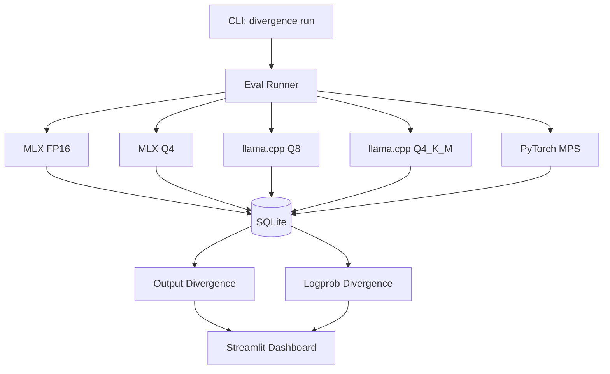

# LLM Backend Divergence

Evaluation framework for measuring behavioral divergence when the same LLM is served through different inference backends on heterogeneous hardware.

## Motivation

In August 2025, Anthropic published a postmortem describing how heterogeneous hardware serving the same model introduced subtle quality regressions that were invisible to availability metrics. Systems reported green — latency within SLO, error rates nominal — while users experienced degraded output quality from a subset of serving nodes.

This project builds a local evaluation harness that reproduces the core detection problem: given the same model (Qwen2.5-7B-Instruct) served through five different backends on Apple Silicon, measure where and how outputs diverge. The goal is not to prove backends are broken, but to build the tooling that would catch quality regressions before they reach production.

## Architecture



## Quickstart

```bash
# Install dependencies (requires Python 3.11+, uv)
make setup

# Install backend-specific dependencies
make setup-llamacpp   # llama.cpp with Metal support
make setup-torch      # PyTorch + transformers

# Download model weights
huggingface-cli download Qwen/Qwen2.5-7B-Instruct

# Run evaluation across backends
divergence run \
  --backends mlx-fp16,mlx-q4,llamacpp-q8,llamacpp-q4km,torch-mps \
  --datasets gsm8k,mmlu,canary \
  --output results/run.db

# Print summary table
divergence summarize results/run.db

# Launch interactive dashboard
streamlit run divergence/dashboard/app.py -- --db results/run.db
```

## Project Structure

```
divergence/
  backends/     # Backend implementations (MLX, llama.cpp, PyTorch MPS)
  runner/       # Eval orchestration and SQLite persistence
  evals/        # Dataset loaders (GSM8K, MMLU, canary)
  analysis/     # Output-level and logprob-level divergence detectors
  dashboard/    # Streamlit visualization app
  cli/          # Typer CLI entry point
docs/
  findings.md      # Results from first real run
  methodology.md   # Measurement methodology
tests/             # pytest suite (137 tests)
```

## Limitations

- **Single machine**: all backends run on one Apple Silicon laptop. No distributed serving, no network latency, no load balancing.
- **Single model**: Qwen2.5-7B-Instruct only. Results may not generalize to other architectures or sizes.
- **No production stack**: no vLLM, no TensorRT-LLM, no serving framework. This measures backend-level divergence, not serving-layer divergence.
- **Apple Silicon only**: MPS, Metal-accelerated llama.cpp, and MLX are Apple-specific. The approach generalizes but the specific backends do not.
- **MPS non-determinism**: PyTorch MPS does not guarantee bitwise reproducibility even with fixed seeds (see `docs/torch-mps-limitations.md`).
- **Logprob approximation**: KL divergence is computed from chosen-token logprobs only, not full next-token distributions. This is a lower bound on true KL.

## License

Apache 2.0 — see [LICENSE](LICENSE).
